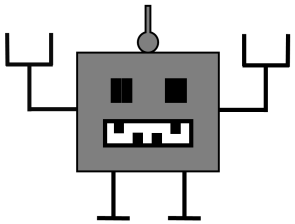

# robotron
our first own robot

Welcome to our robotron!!
Here we can handle all documents, scripts and code for our robot
Here is a basic stucture, please feel free to add, edit and extend if it is needed.

**Vision statement:**
We will build a powerful and adaptable Robotplatform 

* Projcect Plan
  * Who is Who and what to do
  * Ideas for the robot and the future
* Mechanical design
  * Calculations and requirements
  * Blueprints for the robot
  * Pictures
* Electrical design
  * Wireing
  * Blueprints of the electrical circuts
  * Pictures
* Code
  * :-) a hell lot of code in c, c++, phyton etc.
* Frond design 
  * drawings how the robot will look
  * Pictures 

**RoboLution:** Here everyone can see what we have after each Hackday, this we call the RoboLution.

* fist Hackday
https://github.com/Cognirobo/robotron/blob/master/projectplan/2016_04_23_Hackday/images/RoboLution_1.avi

* second Hackday
https://github.com/Cognirobo/robotron/blob/master/projectplan/2016_05_16_Hackday/images/RoboLution_2.avi

* third Hackday
https://github.com/Cognirobo/robotron/blob/master/projectplan/2016_05_26_Hackday/images/RoboLution_3.avi

* fourth Hackday
https://github.com/Cognirobo/robotron/blob/master/projectplan/2016_06_19_Hackday/images/RoboLution_4.avi

**Have fun with Markdown to make it look really cool**
  
https://guides.github.com/features/mastering-markdown/

**Nice tool for windows to see the branches and commits**

https://desktop.github.com/

**Nice tool to make UML and other charts**

http://de.plantuml.com/
and the online version:
http://www.planttext.com/planttext
  
