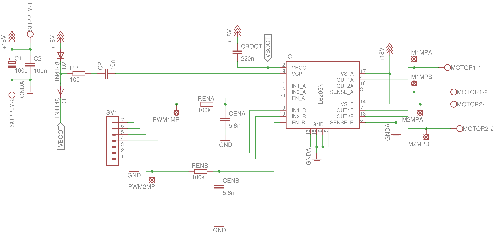
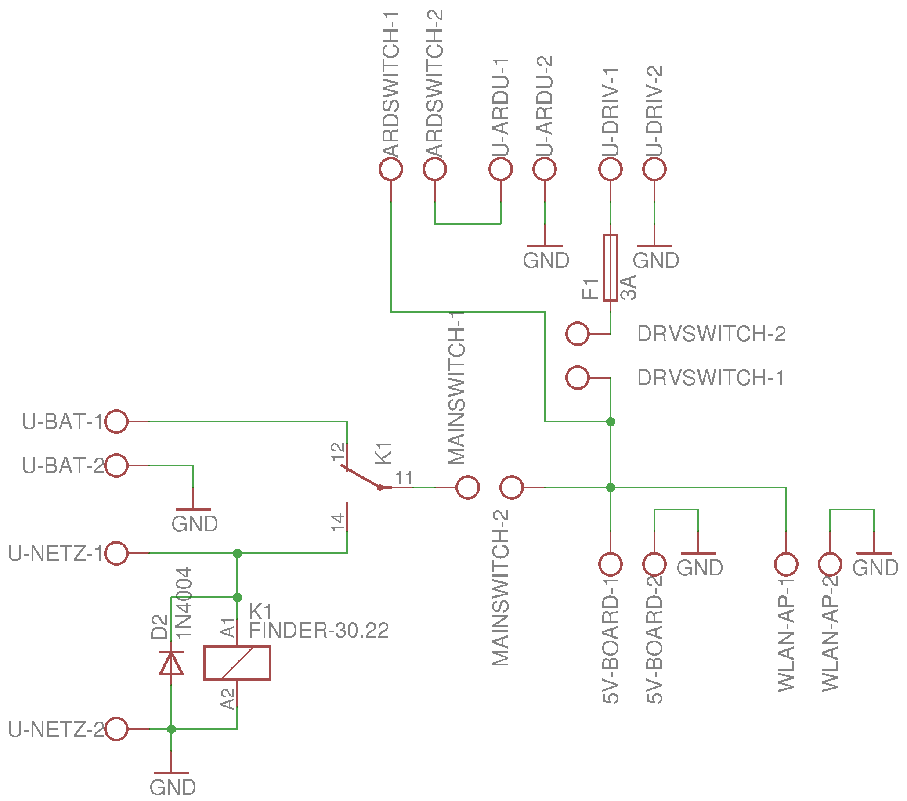
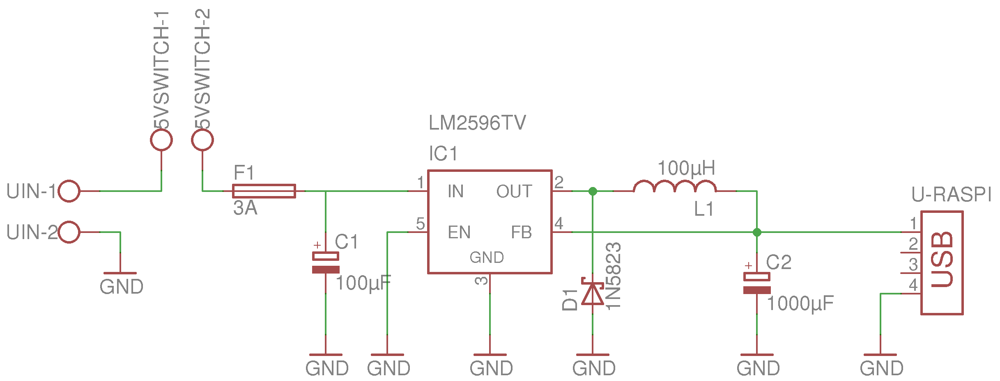
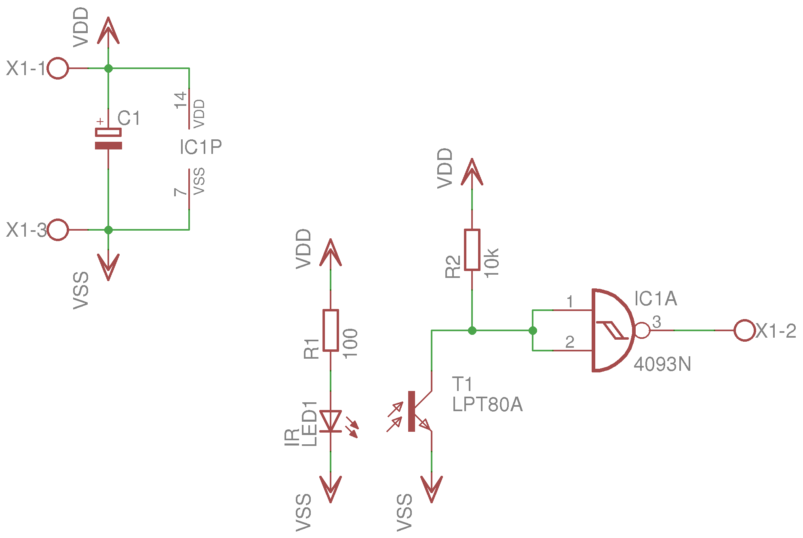

#Electrical Hardware
There are several boards we need to use our robotron. They are so far:

###PWM DC Motor driver
Uses a PWM signal to drive the two DC motors. Can handle up to 50A and 20V, but needs a cooling device on top.

###Voltage distribution
Gets the voltage to every part of our robotron and is the central board to plugin the batteries or the main supply.

###5V DC
Step-down-regulator to get 5V for the Raspberry Pi.

###Encoder of wheel rpm
Produces a signal with a infrared diode and a infrared transistor so the rpm of ever wheel can be read by the arduino and our robot will drive the way we want it. One board per wheel, but the schematics are the same.

