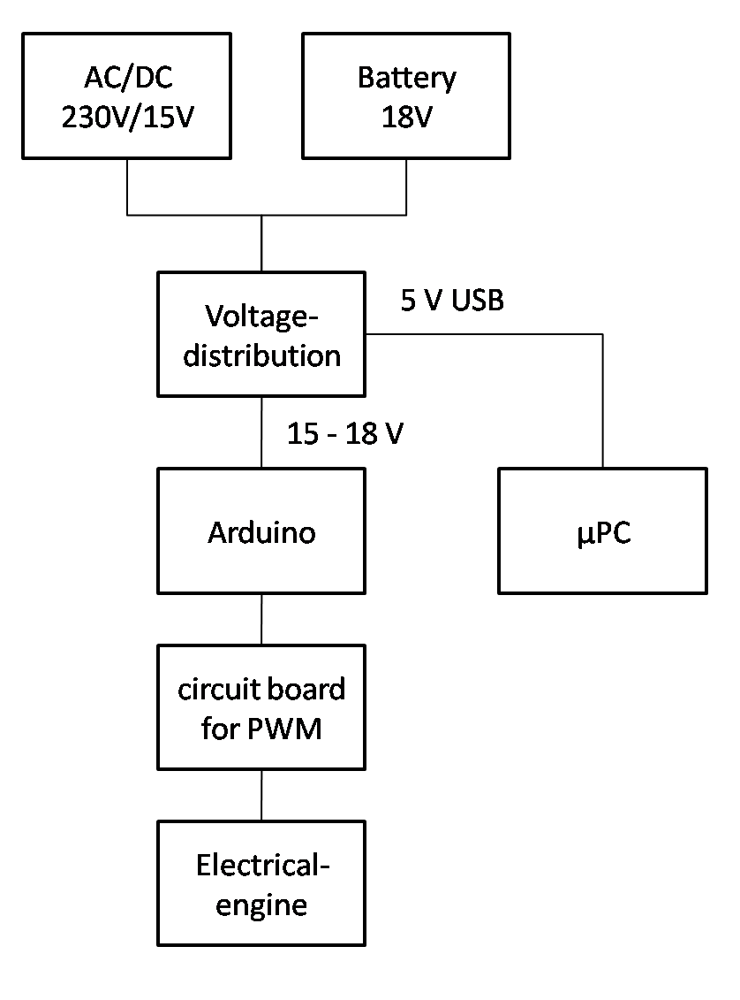

#Proposal for the Powersupply

In order to work good with the robot,
As a developer I need to connect the robot to a 230V energy supply or a battery.

Side conditions:
* switch from battery to main voltage when the 230V supply is connected
* has until now two different current levels: 
  * approximal 15 V for Arduino and elecrtical drive
  * approximal 5 V for everything with USB PI
* overall energy consumption is not clear and has to be investigated

