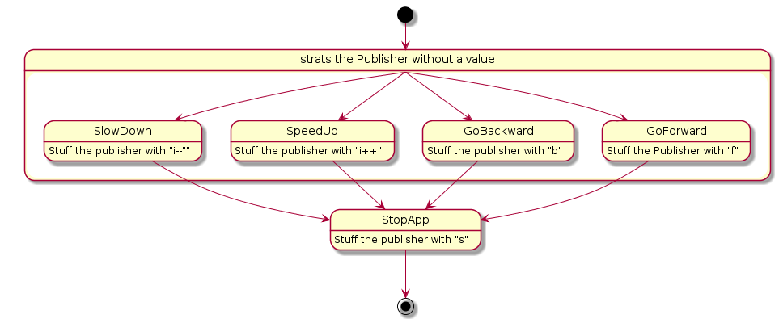

#system arcitecture

Here are serveal views of the Robotron. First is from an user Point of view. What can the Robotron do. In the next one it is a more software and architektural point of view. wich modul is doing what and how. The thired and last one is the view that is class based. 

Use case: Remote control the Robotron with a Smartphone app:

The app is increasing the lengt of the integer. On arduino side the lenght of the string is used to determin the commando. 

